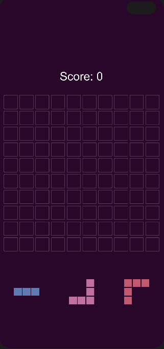

# 1010! Block Blitz

## Description

1010! Block Blitz is a fast-paced puzzle game inspired by the popular 1010! game. In this game, you are presented with a set of randomly generated shapes that you must strategically place on a grid. When you complete a full row or column, it gets cleared, awarding you points. The objective is to keep fitting the pieces on the grid without running out of valid moves. Enjoy a challenging blend of strategic planning and quick decision-making as you aim for the highest score!

## To-Do List

### Completed Features
- [x] Board creation and grid management
- [x] Shape spawning via the Spawner
- [x] Shape placement and collision validation
- [x] Clearing complete rows and columns
- [x] Score system integration
- [x] Sound effects integration via SFXManager
- [x] Particle effects integration via ParticleEffectsManager
- [x] Game Over detection and restart functionality
- [x] Basic UI for Game Over screen

### Pending Features
- [ ] Additional visual polish and animations
- [ ] Advanced scoring mechanics (e.g., combo multipliers)
- [ ] Leaderboard and high score tracking
- [ ] Alternative game modes or challenge levels
- [ ] Enhanced UI/UX design improvements
- [ ] Optimization for mobile devices and touch controls
- [ ] Further playtesting and balance adjustments

## How to Play

Place the falling shapes into the grid so that they form complete rows or columns. Once a row or column is fully filled, it will be cleared, and you'll earn points. The game ends when no more valid moves are available. Aim for the highest score and challenge yourself to beat your best performance!

## Installation

1. Clone or download the repository.
2. Open the project in Unity.
3. Ensure all necessary assets (sprites, audio files, etc.) are located in the **Assets** folder.
4. Press **Play** in the Unity Editor to start the game.

## License

This project is licensed under the [MIT License](LICENSE).
